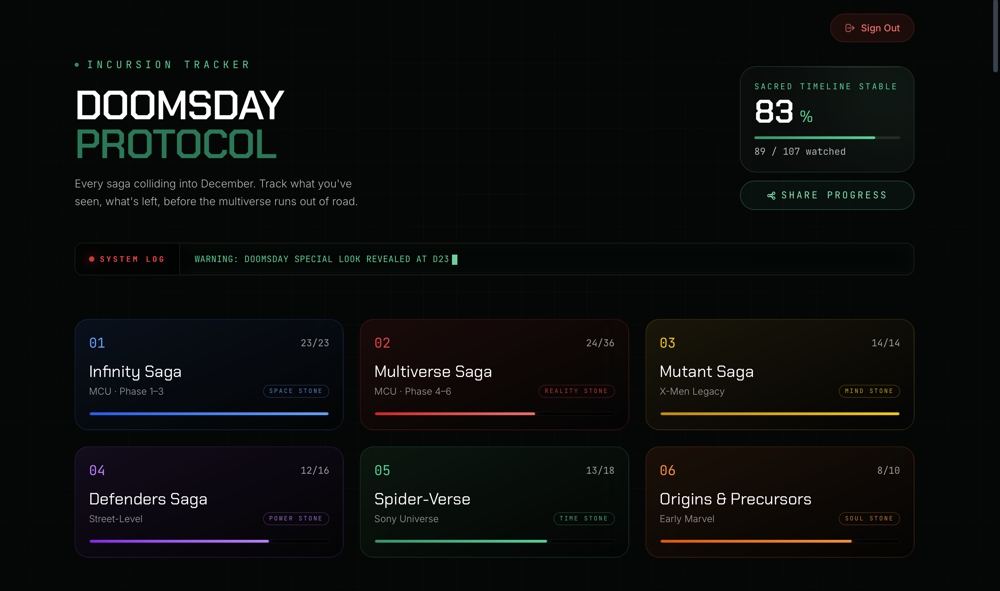
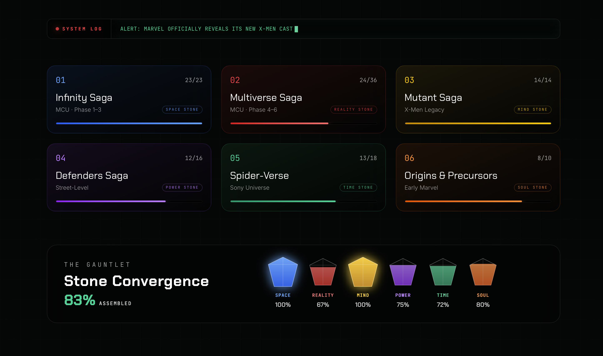

# 🌀 Incursion Tracker

A cinematic Marvel Multiverse watch tracker built to help fans navigate the massive collection of movies and series leading into **Avengers: Doomsday**.

Track your progress across the MCU, X-Men, Spider-Verse, Defenders and other Marvel universes - all organized into a single multiversal timeline.

 

---

## 🧬 The Concept

The Marvel Multiverse has become massive.

Between the MCU, Fox's X-Men universe, Sony's Spider-Verse, the Defenders Saga and countless alternate realities, figuring out **what to watch before the next major crossover** has become increasingly difficult.

**Incursion Tracker** brings everything together in one interactive timeline, allowing fans to explore Marvel's cinematic universes, follow the recommended watch order, track what they've watched, and monitor their progress toward **Avengers: Doomsday**.

> **One timeline. Countless universes. One mission.**

---

## ⚡ Features

- **Multiverse Watch Order** — Movies and series organized across MCU, X-Men, Spider-Verse, Defenders and other Marvel timelines.
- **Progress Tracking** — Track watched titles and monitor your overall journey through the Multiverse.
- **Secure Authentication** — Email OTP verification and personalized user accounts.
- **Saga Navigation** — Explore titles by saga, universe and chronological watch order.
- **Live Marvel News** — Stay updated with the latest Marvel developments.
- **Earth-616 Radio** — An integrated Marvel-themed Apple Music playlist.
- **Responsive Cinematic UI** — Built with a dark, immersive interface inspired by the TVA and Multiverse aesthetic.

---

## 📸 Interface Preview

### The Convergence Gauntlet

### Multiversal Timeline

### Title Details & Watch Status

---

## 🛠️ Tech Stack

### Frontend
- React.js
- Vite
- Tailwind CSS
- Axios

### Backend
- Python
- Django
- Django REST Framework
- PostgreSQL
- SQLite
- SMTP / Django Email

---

## 👨‍💻 About

**Hemanth**

Incursion Tracker is an independent full-stack development project built by a Marvel fan, combining my passion for Marvel with my interest in web development.